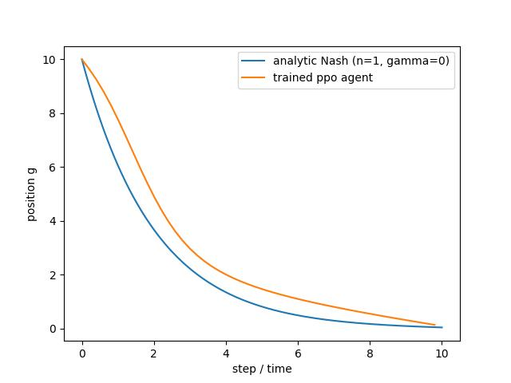
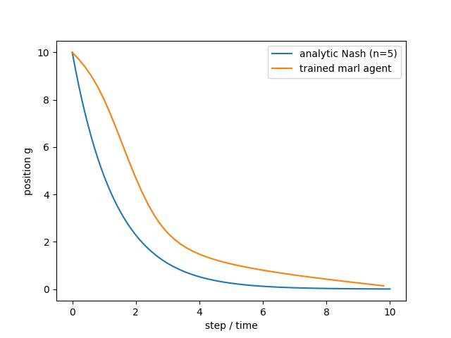

# N-Player Optimal Execution: MARL vs Analytical Nash Equilibrium

## Table of Contents

1. [Introduction](#introduction)
2. [Breaking Down Terminal Liquidation](#breaking-down-terminal-liquidation)
3. [Breaking Down Running Inventory Penalty](#breaking-down-running-inventory-penalty)
4. [From Performance Criterion to the HJB Equation](#from-performance-criterion-to-the-hjb-equation)
5. [Deriving the Optimal Strategy and Ansatz](#deriving-the-optimal-strategy-and-ansatz)
6. [Analytical Nash Equilibrium](#analytical-nash-equilibrium)
7. [References](#references)


## Introduction

The aim of the project was to examine the convergence between Multi-Agent Reinforcement Learning approach and mathematical ground truth of position liquidation. The agents do not observe each others' actions or positions, yet got a feedback from the environment they influence by constant sell.

Following the framework established by Cartea et al. (2015), the primary objective of a trading agent is to maximize the expected execution performance criterion over a finite time horizon $[0, T]$:

$$H^{\nu}(t, x, S, q) = \mathbb{E}_{t,x,S,q} \left[ \underbrace{X_T^{\nu}}_{\text{Terminal Cash}} + \underbrace{Q_T^{\nu} \left(S_T^{\nu} - \alpha Q_T^{\nu}\right)}_{\text{Terminal Execution}} - \underbrace{\varphi \int_t^T (Q_u^{\nu})^2 \, du}_{\text{Inventory Penalty}} \right]$$

where:
* $X_T^{\nu}$ – cash balance at time $T$,
* $Q_T^{\nu}$ – remaining inventory at time $T$,
* $S_T^{\nu}$ – asset mid-price at time $T$,
* $\alpha$ – terminal liquidation penalty (`alpha`),
* $\varphi$ – running inventory risk penalty (`varphi`).

### Breaking Down Terminal Cash ($X_T^{\nu}$)

The accumulation of cash $X_T^{\nu}$ is modeled by integrating the instant revenue generated from selling inventory at speed $\nu_t$:

$$dX_t^{\nu} = \hat{S}_t^{\nu} \nu_t \, dt$$

where $\hat{S}_t^{\nu}$ represents the effective fill price. 

Accounting for a constant bid-ask spread $\Delta$ and a temporary price impact function $f(\nu_t)$, the general execution price for both acquisition (+) and liquidation (-) is formulated as:

$$\hat{S}_t^{\nu} = S_t^{\nu} \pm \left( \frac{1}{2}\Delta + f(\nu_t) \right)$$

Since this model focuses explicitly on a **liquidation** strategy (selling inventory at speed $\nu_t$), the execution price subtracts both spread and temporary impact penalties:

$$\hat{S}_t^{\nu} = S_t^{\nu} - \frac{1}{2}\Delta - f(\nu_t)$$

Substituting $\hat{S}_t^{\nu}$ yields the explicit differential cash dynamics:

$$dX_t^{\nu} = \left( S_t^{\nu} - \frac{1}{2}\Delta - f(\nu_t) \right) \nu_t \, dt$$

Assuming a linear temporary market impact $f(\nu_t) = \kappa \nu_t$ (represented as `kappa` in the codebase):

$$dX_t^{\nu} = S_t^{\nu} \nu_t \, dt - \frac{1}{2}\Delta \nu_t \, dt - \kappa \nu_t^2 \, dt$$

By the **Fundamental Theorem of Calculus**, integrating the differential $dX_t^{\nu}$ over the interval $[0, T]$ recovers the total change in cash ($\int_0^T dX_t^{\nu} = X_T^{\nu} - X_0^{\nu}$). Isolating the terminal state $X_T^{\nu}$ pulls the initial value $X_0^{\nu}$ outside the integral:

$$X_T^{\nu} = X_0^{\nu} + \int_0^T dX_t^{\nu} = X_0^{\nu} + \int_0^T \left( S_t^{\nu} \nu_t - \frac{1}{2}\Delta \nu_t - \kappa \nu_t^2 \right) dt$$

Assuming zero initial cash ($X_0^{\nu} = 0$) and setting aside fixed spread costs, substituting $dX_t^{\nu}$ directly yields:

> [!NOTE]
> ### Justification for Setting Aside the Spread Term ($\Delta$)
>
> The cumulative revenue loss due to the bid-ask spread over $[0, T]$ is given by:
>
> $$\int_0^T \frac{1}{2}\Delta \nu_t \, dt = \frac{1}{2}\Delta \int_0^T \nu_t \, dt$$
>
> Since $\nu_t = -\dot{Q}_t$, applying the Fundamental Theorem of Calculus yields:
>
> $$\int_0^T \frac{1}{2}\Delta \nu_t \, dt = \frac{1}{2}\Delta (Q_0 - Q_T)$$
>
> Under full liquidation ($Q_T = 0$), this term collapses to the deterministic constant $\frac{1}{2}\Delta Q_0$. Because $Q_0$ and $\Delta$ are fixed, exogenous parameters, this constant offset does not depend on the control trajectory $\nu_t$. Consequently, its derivative with respect to $\nu_t$ is zero, leaving the optimal execution policy $\nu_t^*$ unaffected. It can therefore be set aside during functional optimization without loss of generality.

### Breaking Down Terminal Liquidation

$$\text{Terminal Value} = Q_T^{\nu} \left( S_T^{\nu} - \alpha Q_T^{\nu} \right)$$

At the end of the trading period ($t = T$), any remaining shares $Q_T^{\nu}$ must be sold immediately. The money received from this final sale is given by the formula above, where $\alpha$ (represented as `alpha` in the code) is the penalty parameter for selling leftover stock.

Expanding this formula splits the final value into two parts:

$$\text{Terminal Value} = Q_T^{\nu} S_T^{\nu} - \alpha (Q_T^{\nu})^2$$

* **Market Value ($Q_T^{\nu} S_T^{\nu}$):** The basic value of the remaining shares at the final market price $S_T^{\nu}$.
* **Terminal Penalty ($-\alpha (Q_T^{\nu})^2$):** A penalty for holding leftover stock at time $T$. As the remaining position $Q_T^{\nu}$ grows, the price discount per share increases linearly ($\alpha Q_T^{\nu}$), resulting in a quadratic penalty on the total value.

> [!NOTE]
> ### Role of $\alpha$
>
> The parameter $\alpha$ controls how strictly leftover inventory is penalized:
> 1. **Economic Meaning:** It represents the extra price drop caused by dumping all remaining shares at once at time $T$.
> 2. **Full Liquidation ($\alpha \to \infty$):** When $\alpha \to \infty$, the penalty for keeping any stock becomes infinite. This forces the trading strategy to sell all inventory during the period $[0, T]$, guaranteeing $Q_T^{\nu} = 0$.


### Breaking Down Running Inventory Penalty

While waiting to sell, holding unsold shares carries risk because stock prices can change. To account for this, the model adds an extra penalty cost over time:

$$\text{Running Inventory Penalty} = \phi \int_0^T (Q_t^{\nu})^2 \, dt$$

where $\phi$ (represented as `phi` in the code) sets how strongly the model penalizes holding stock.

Here is what each part means:

* **Shares Held ($Q_t^{\nu}$):** The number of unsold shares in your portfolio at time $t$.
* **Squared Penalty ($(Q_t^{\nu})^2$):** Makes holding large amounts of stock much more expensive. Holding 2,000 shares costs four times as much penalty as holding 1,000 shares.
* **Risk Parameter ($\phi$):** Controls how much the model fears holding stock. A higher $\phi$ forces the model to sell faster.
* **Total Over Time ($\int_0^T \dots dt$):** Adds up this penalty cost for every second from start ($t = 0$) to end ($t = T$).

> [!NOTE]
> ### Why Use a Squared Term ($\phi Q_t^2$)?
>
> Using $Q_t^2$ instead of just $Q_t$ does two main things:
> 1. **Prevents Big Losses:** Holding many shares carries higher price risk. Squaring the number of shares forces the model to treat big positions as very dangerous.
> 2. **Sells Fast First:** Because the penalty is highest when you hold many shares, the model sells quickly at the beginning and slows down as fewer shares remain.

### From Performance Criterion to the HJB Equation

The model begins with the expected total value formula $H^{\nu}$, which sums up all rewards and penalties from time $t$ to $T$:

$$H^{\nu}(t, x, S, q) = \mathbb{E}_{t,x,S,q} \left[ \underbrace{X_T^{\nu}}_{\text{Terminal Cash}} + \underbrace{Q_T^{\nu} \left(S_T^{\nu} - \alpha Q_T^{\nu}\right)}_{\text{Terminal Execution}} - \underbrace{\phi \int_t^T (Q_u^{\nu})^2 \, du}_{\text{Inventory Penalty}} \right]$$

To find the best outcome, we define the **Value Function** $V(t, x, S, q)$ as the maximum expected value achieved by choosing the optimal trading speed $\nu^*$:

$$V(t, x, S, q) = \sup_{\nu} H^{\nu}(t, x, S, q)$$

The mid-price moves with the agent's permanent impact $`g(\nu)`$ and random shocks of volatility $`\sigma`$, driven by a Brownian motion $`W_t`$:

$$dS_t = -g(\nu_t) dt + \sigma dW_t$$

Applying Dynamic Programming yields the full Hamilton-Jacobi-Bellman (HJB) equation:

$$0 = \left( \partial_t + \frac{1}{2}\sigma^2 \partial_{SS} \right) V - \phi q^2 + \sup_{\nu} \left[ \left( \nu (S - f(\nu)) \partial_x - g(\nu) \partial_S - \nu \partial_q \right) V \right]$$

---

### Deriving the Optimal Strategy and Ansatz

#### 1. Isolating the Optimization Term to Find $\nu^*$
To maximize the HJB equation over $\nu$, we isolate the supremum term containing the trading speed:

$$\sup_{\nu} \left[ \left( \nu (S - f(\nu)) \partial_x - g(\nu) \partial_S - \nu \partial_q \right) V \right]$$

Plugging in linear temporary impact $f(\nu) = \kappa \nu$ and permanent impact $g(\nu) = b \nu$, the expression inside the bracket expands to:

$$\nu S \partial_x V - \kappa \nu^2 \partial_x V - b \nu \partial_S V - \nu \partial_q V$$

To find the optimal speed $\nu^*$, we set the derivative of this term with respect to $\nu$ equal to zero (First-Order Condition):

$$\frac{\partial}{\partial \nu} \left[ \nu S \partial_x V - \kappa \nu^2 \partial_x V - b \nu \partial_S V - \nu \partial_q V \right] = 0$$

$$S \partial_x V - 2\kappa \nu \partial_x V - b \partial_S V - \partial_q V = 0$$

Solving directly for $\nu$ yields the optimal trading speed formula:

$$\nu^* = \frac{(S \partial_x - b \partial_S - \partial_q) V}{2\kappa \partial_x V}$$

#### 2. Substituting $\nu^*$ Back into the Optimization Term
We take the original expression inside the supremum:

$$\left[ \left( \nu (S - f(\nu)) \partial_x - g(\nu) \partial_S - \nu \partial_q \right) V \right]$$

Plugging in linear temporary impact $f(\nu) = \kappa \nu$ and permanent impact $g(\nu) = b \nu$ expands this term to:

$$\nu (S \partial_x - b \partial_S - \partial_q) V - \kappa \nu^2 \partial_x V$$

Plugging our formula for $\nu^*$ in place of every $\nu$ gives:

$$\left( \frac{(S \partial_x - b \partial_S - \partial_q) V}{2\kappa \partial_x V} \right) (S \partial_x - b \partial_S - \partial_q) V - \kappa \left( \frac{(S \partial_x - b \partial_S - \partial_q) V}{2\kappa \partial_x V} \right)^2 \partial_x V$$

Simplifying both parts to a common denominator ($4\kappa \partial_x V$):

$$\frac{2 [(S \partial_x - b \partial_S - \partial_q) V]^2}{4\kappa \partial_x V} - \frac{[(S \partial_x - b \partial_S - \partial_q) V]^2}{4\kappa \partial_x V} = \frac{[(S \partial_x - b \partial_S - \partial_q) V]^2}{4\kappa \partial_x V}$$

Inserting this result back into the full HJB equation yields:

$$0 = \left( \partial_t + \frac{1}{2}\sigma^2 \partial_{SS} \right) V - \phi q^2 + \frac{[(S \partial_x - b \partial_S - \partial_q) V]^2}{4\kappa \partial_x V}$$

#### 3. Separating Cash from Risk (Ansatz)
At terminal time $T$, trading stops and the total portfolio value is known exactly from the terminal condition:

$$V(T, x, S, q) = x + qS - \alpha q^2$$

This reveals a natural structure: cash $x$, mark-to-market stock value $qS$, and a terminal inventory penalty $-\alpha q^2$. Extending this economic intuition backward to any time $t < T$ motivates our trial solution (Ansatz):

$$V(t, x, S, q) = x + qS + v(t, S, q)$$

where $v(T, S, q) = -\alpha q^2$. The terms represent:
* **$x + qS$:** Baseline portfolio value if all shares could be sold instantly at mid-price $S$ with zero market impact and zero risk.
* **$v(t, S, q)$:** The **inventory value function**. It extends the terminal penalty backward in time to track all future execution costs, price impact, and inventory risk from $t$ to $T$.

* **Why $v$ depends on $(t, S, q)$ and not $x$:**
  * **No $x$:** Cash carries zero execution risk or price impact ($\partial_x V = 1$), so its value is purely additive ($+x$) and drops out of the PDE completely.
  * **$(t, S, q)$:** These state variables carry all system dynamics—inventory risk ($\phi q^2$), remaining time ($T - t$), and market price ($S$).

#### 4. Substituting the Ansatz into the HJB Equation
We calculate the partial derivatives of $V(t, x, S, q) = x + qS + v(t, S, q)$:

* $\partial_x V = 1$
* $\partial_S V = q + \partial_S v$
* $\partial_q V = S + \partial_q v$
* $\partial_t V = \partial_t v$
* $\partial_{SS} V = \partial_{SS} v$

Plugging all partial derivatives directly into the complete optimization term $\frac{[(S \partial_x - b \partial_S - \partial_q) V]^2}{4\kappa \partial_x V}$:

$$\frac{[(S(1) - b(q + \partial_S v) - (S + \partial_q v))]^2}{4\kappa(1)}$$

Simplifying the numerator and squaring eliminates the negative sign:

$$\frac{\left( -\left[ b(q + \partial_S v) + \partial_q v \right] \right)^2}{4\kappa} = \frac{\left[ b(q + \partial_S v) + \partial_q v \right]^2}{4\kappa}$$

Substituting this expression back into the main HJB equation yields:

$$0 = \left( \partial_t + \frac{1}{2}\sigma^2 \partial_{SS} \right) v - \phi q^2 + \frac{\left[ b(q + \partial_S v) + \partial_q v \right]^2}{4\kappa}$$

#### 5. Reduction to $v(t, q)$
Since neither the PDE above nor the terminal condition $v(T, q) = -\alpha q^2$ explicitly depends on $S$, the function $v$ is independent of the share price ($v(t, S, q) = v(t, q)$). Thus, all price derivatives vanish:

$$\partial_S v = 0 \quad \text{and} \quad \partial_{SS} v = 0$$

Assuming zero permanent impact ($b = 0$), the term $bq$ vanishes as well, reducing the equation to its final form for $v(t, q)$:

$$0 = \partial_t v(t, q) - \phi q^2 + \frac{(\partial_q v(t, q))^2}{4\kappa}$$

#### 6. Expressing Optimal Speed in Terms of $v(t, q)$
We start from the general formula for optimal trading speed:

$$\nu^* = \frac{(S \partial_x - b \partial_S - \partial_q) V}{2\kappa \partial_x V}$$

Substituting our partial derivatives ($\partial_x V = 1$, $\partial_S V = q + \partial_S v$, $\partial_q V = S + \partial_q v$):

$$\nu^* = \frac{S(1) - b(q + \partial_S v) - (S + \partial_q v)}{2\kappa(1)}$$

Applying zero permanent impact ($b = 0$) and price independence ($\partial_S v = 0$) simplifies the expression directly to[cite: 1]:

$$\nu^*(t, q) = \frac{S(1) - 0 - (S + \partial_q v)}{2\kappa(1)} = -\frac{\partial_q v(t, q)}{2\kappa}$$

#### 7. Reducing the PDE to a Riccati ODE
Both the running inventory penalty ($\phi q^2$) and the terminal penalty ($-\alpha q^2$) are quadratic in $q$, so we propose a quadratic Ansatz for $v(t, q)$:

$$v(t, q) = -a(t) q^2$$

with terminal condition $a(T) = \alpha$, read off from $v(T, q) = -\alpha q^2$.

> [!NOTE]
> ### Why the minus sign?
> $v$ is a *value* (money gained), while holding inventory is a *cost*. Writing $v = -a q^2$ makes $a(t) > 0$ the cost per unit of squared inventory, which is exactly the variable `a` solved for in `ricatti.py`.

Its partial derivatives are:

* $\partial_t v = -\dot{a}(t) q^2$
* $\partial_q v = -2a(t) q$

Substituting these into the reduced PDE $0 = \partial_t v - \phi q^2 + \frac{(\partial_q v)^2}{4\kappa}$:

$$-\dot{a}(t) q^2 - \phi q^2 + \frac{(-2a(t) q)^2}{4\kappa} = 0$$

Squaring removes the minus sign, $(-2aq)^2 = 4a^2q^2$, so:

$$-\dot{a}(t) q^2 - \phi q^2 + \frac{a(t)^2}{\kappa} q^2 = 0$$

Factoring out $q^2$ (the equation must hold for every inventory level $q$) and solving for $\dot{a}$ gives a single Riccati Ordinary Differential Equation:

$$\dot{a}(t) = \frac{a(t)^2}{\kappa} - \phi, \qquad a(T) = \alpha$$

It is integrated backward in time from $T$ to $0$ and was implemented in Python (`riccati.py`):

```python
def da_dt(t, a):
    return a**2 / kappa - varphi

ls = np.linspace(T, 0, 200)

solver = solve_ivp(da_dt, (T, 0), y0=[kappa], t_eval=ls,
                   rtol=1e-10, atol=1e-12)
```

`da_dt` is the right-hand side of the Riccati ODE, solved backward from the terminal condition $a(T) = \alpha$ (set to $\alpha = \kappa$ in the code) and evaluated at 200 points between $T$ and $0$.


## From One Agent to N Agents

So far a single agent traded alone. With $`N`$ agents selling the same asset at the same time, each agent's selling moves the price for everyone. The multi-agent model follows Evangelista & Thamsten (2020, Sec. 2, eqs. (2.1)–(2.5)), with constant parameters, identical for all agents.

### Price and Cash of Agent i

In Evangelista & Thamsten each agent $`i`$ has an inventory $`q^i`$, trades at rate $`\nu^i`$, and faces a price that reacts to the average trading rate of all agents:

```math
dq_t^i = \nu_t^i dt, \qquad ds_t = \alpha \frac{1}{N} \sum_{j=1}^N \nu_t^j dt + dP_t, \qquad \hat{s}_t^i = s_t + \kappa \nu_t^i, \qquad dc_t^i = -\hat{s}_t^i \nu_t^i dt
```

(their eqs. (2.1)–(2.3), with zero drift). In this project agents sell, so in its notation:

* $`q^i \to g_i`$ – remaining position of agent $`i`$, starting from $`g_i(0) = g_0`$,
* $`\nu^i \to -u_i`$ – selling rate of agent $`i`$,
* $`\alpha / N \to \gamma`$ – permanent impact per unit sold by any agent (their $`\alpha`$ is the permanent impact, unrelated to the terminal penalty $`\alpha`$ of the single-agent case),
* $`dP_t \to \sigma dW_t`$ – random price moves: in Evangelista & Thamsten $`P_t`$ is a general martingale, and a Brownian motion with volatility $`\sigma`$ is its special case used in the single-agent model of Cartea et al. (the source of the $`\frac{1}{2}\sigma^2 \partial_{SS}`$ term in the HJB equation),
* $`c^i \to X_i`$ – cash of agent $`i`$.

Substituting $`\nu_i = -u_i`$ into their eq. (2.1) gives $`dg_i = -u_i dt`$: the position falls while the agent sells. The same substitution flips the signs in the price and cash equations below.

The model then reads:

```math
dg_i = -u_i dt, \qquad dS_t = -\gamma \sum_j u_j dt + \sigma dW_t, \qquad \hat{S}_{i,t} = S_t - \kappa u_i, \qquad dX_{i,t} = \hat{S}_{i,t} u_i dt
```

* **Permanent impact ($`\gamma`$):** every unit sold by **any** agent lowers the mid-price for good. This is the only channel through which agents affect each other.
* **Temporary impact ($`\kappa`$):** the fill price of agent $`i`$ is lowered by its **own** selling only, as in the single-agent case.

With a single agent, $`N = 1`$, this is the single-agent model of Cartea et al. with permanent impact $`b = \gamma`$; for $`\gamma = 0`$ it reduces to the case derived above.

### Performance Criterion of Agent i

As in the single-agent case, agent $`i`$ values its money at $`T`$ – cash plus the remaining position marked at the mid-price – minus the inventory and terminal penalties, relative to its initial wealth (Evangelista & Thamsten, eq. (2.5)):

```math
\mathbb{E}\Big[ X_{i,T} + g_{i,T} S_T - \varphi \int_0^T g_i^2 dt - A g_{i,T}^2 - \left( X_{i,0} + g_{i,0} S_0 \right) \Big]
```

where $`\varphi`$ is the inventory penalty (their $`\lambda`$) and $`A`$ the terminal penalty (their $`A`$; $`\alpha`$ in the single-agent case). Each agent maximises this over its **own** selling rate $`u_i`$, taking the others' rates as given; when nobody can gain by changing its own rate alone, the agents are in a Nash equilibrium (their Definition 2.1).

### From Value to Cost

#### 1. Cash of agent i

The money agent $`i`$ receives for selling is price times quantity: selling $`u_i dt`$ units at the price $`\hat{S}_{i,t}`$ brings $`\hat{S}_{i,t} u_i dt`$. Substituting the price $`\hat{S}_{i,t} = S_t - \kappa u_i`$:

```math
dX_{i,t} = (S_t - \kappa u_i) u_i dt = S_t u_i dt - \kappa u_i^2 dt
```

* $`S_t u_i dt`$ – what the sale would bring at the mid-price,
* $`\kappa u_i^2 dt`$ – what agent $`i`$ loses because its own selling pushes its fill price down.

Integrating over $`[0, T]`$ (Fundamental Theorem of Calculus, as in the single-agent case):

```math
X_{i,T} = X_{i,0} + \int_0^T S_t u_i dt - \kappa \int_0^T u_i^2 dt
```

Substituting this into the criterion of agent $`i`$:

```math
\sup_{u_i} \mathbb{E}\Big[ \int_0^T S_t u_i dt - \kappa \int_0^T u_i^2 dt + g_{i,T} S_T - \varphi \int_0^T g_i^2 dt - A g_{i,T}^2 - g_{i,0} S_0 \Big]
```

(the initial cash $`X_{i,0}`$ cancels with the same term in the initial wealth).

#### 2. Expanding the terminal value

The terminal value $`g_{i,T} S_T`$ is a single number at $`T`$, but it depends on everything that happened along the way, because every sale moves the price. To express the cost step by step, it is rewritten as its initial value plus the sum of its changes over time:

```math
g_{i,T} S_T = g_{i,0} S_0 + \int_0^T d(g_i S)
```

The change $`d(g_i S)`$ is split by the product rule into a part driven by the price and a part driven by the agent's own selling:

```math
d(g_i S) = g_i dS + S dg_i
```

(no extra Itô term, because $`g_i`$ has no random part). Substituting it into the integral and using $`dg_i = -u_i dt`$:

```math
g_{i,T} S_T = g_{i,0} S_0 + \int_0^T g_i dS_t - \int_0^T u_i S_t dt
```

Substituting this into the criterion of agent $`i`$:

```math
\sup_{u_i} \mathbb{E}\Big[ \underbrace{\int_0^T S_t u_i dt - \int_0^T u_i S_t dt}_{= 0} + \int_0^T g_i dS_t - \kappa \int_0^T u_i^2 dt - \varphi \int_0^T g_i^2 dt - A g_{i,T}^2 \Big]
```

(the terms $`g_{i,0} S_0`$ cancel as well). The money from selling at the mid-price cancels with the same term from the terminal value, so the price level $`S_t`$ disappears and only the price changes $`dS_t`$ remain:

```math
\sup_{u_i} \mathbb{E}\Big[ \int_0^T g_i dS_t - \kappa \int_0^T u_i^2 dt - \varphi \int_0^T g_i^2 dt - A g_{i,T}^2 \Big]
```

#### 3. Substituting the price dynamics

With $`dS_t = -\gamma \sum_j u_j dt + \sigma dW_t`$:

```math
\int_0^T g_i dS_t = -\gamma \int_0^T g_i \sum_j u_j dt + \sigma \int_0^T g_i dW_t
```

#### 4. Taking the expectation

The stochastic integral has zero expectation, $`\mathbb{E}\left[ \sigma \int_0^T g_i dW_t \right] = 0`$, because $`g_i`$ at each moment is known before the next price shock $`dW_t`$ arrives. The criterion of agent $`i`$ becomes:

```math
\sup_{u_i} \Big( - \mathbb{E}\Big[ \int_0^T \Big( \kappa u_i^2 + \gamma g_i \sum_j u_j + \varphi g_i^2 \Big) dt + A g_{i,T}^2 \Big] \Big)
```

#### 5. From maximising value to minimising cost

Maximising minus a quantity is the same as minimising the quantity itself, so each agent minimises the cost

```math
J_i = \mathbb{E}\Big[ \int_0^T \Big( \underbrace{\kappa u_i^2}_{\text{temporary impact}} + \underbrace{\gamma g_i \sum_j u_j}_{\text{permanent impact}} + \underbrace{\varphi g_i^2}_{\text{inventory penalty}} \Big) dt + \underbrace{A g_{i,T}^2}_{\text{terminal penalty}} \Big]
```

which is the second line of Evangelista & Thamsten, eq. (2.5), in this project's notation.

In `marl_env.py` the reward of each step is minus the running cost over one step, and the terminal penalty is added at the last step:

```python
rewards = {agent: -(self.kappa * actions[agent] ** 2
                    + self.gamma * self.positions[agent] * total_u
                    + self.varphi * self.positions[agent] ** 2) * self.dt
           for agent in self.agents}
```


## Analytical Nash Equilibrium

### The equation of the equilibrium

For constant parameters, identical for all agents, Evangelista & Thamsten (2020, Theorem 3.11) show that in the Nash equilibrium the average position $`E_N(t) = \frac{1}{N}\sum_i q^i_t`$ solves the second-order ODE

```math
\begin{cases}
2\kappa \ddot{E}_N + \alpha \left(1 - \frac{1}{N}\right) \dot{E}_N - 2\lambda E_N = 0 \\
E_N(0) = \frac{1}{N}\sum_{i=1}^N q_0^i, \qquad \kappa \dot{E}_N(T) + A E_N(T) = \frac{\alpha}{2N} E_N(T)
\end{cases}
\qquad \text{(their eq. (3.31))}
```

All agents start from the same position $`g_0`$ and face the same problem, so in equilibrium they all sell identically and each agent's position equals the average, $`g(t) = E_N(t)`$. With $`\alpha = N\gamma`$ and $`\lambda = \varphi`$:

```math
\begin{cases}
2\kappa \ddot{g} + (N - 1)\gamma \dot{g} - 2\varphi g = 0 \\
g(0) = g_0, \qquad \kappa \dot{g}(T) + A g(T) = \frac{\gamma}{2} g(T)
\end{cases}
```

* **$`2\kappa \ddot{g}`$** – temporary impact: changing the selling speed is costly,
* **$`(N-1)\gamma \dot{g}`$** – permanent impact of the other $`N - 1`$ agents: their selling lowers the value of the position agent $`i`$ still holds, which pushes it to sell earlier,
* **$`2\varphi g`$** – inventory penalty: holding a position is costly,
* **$`g(0) = g_0`$** – every agent starts with the full position,
* **$`\kappa \dot{g}(T) + A g(T) = \frac{\gamma}{2} g(T)`$** – at $`T`$ the selling speed balances the terminal penalty on what is left.

Since $`u = -\dot{g}`$, the second derivative $`\ddot{g} = -\dot{u}`$ is the rate at which the selling speed changes: the equation describes how an agent in equilibrium slows down its selling over time.

With a single agent and no permanent impact, $`N = 1`$, $`\gamma = 0`$, the middle term disappears and the equation reduces to the single-agent case derived above.

### Closed-form solution

The same theorem gives the solution explicitly (their eq. (3.32)):

```math
E_N(t) = E_N(0) \frac{y_N(t)}{y_N(0)}, \qquad
y_N(t) = -\Big[ r_N^- + \tfrac{1}{\kappa}\big(A - \tfrac{\alpha}{2N}\big) \Big] \frac{e^{-r_N^+ (T-t)}}{2\theta_N} + \Big[ r_N^+ + \tfrac{1}{\kappa}\big(A - \tfrac{\alpha}{2N}\big) \Big] \frac{e^{-r_N^- (T-t)}}{2\theta_N}
```

```math
\theta_N = \frac{1}{4\kappa} \sqrt{\alpha^2 \left(1 - \frac{1}{N}\right)^2 + 16 \lambda \kappa}, \qquad r_N^{\pm} = -\frac{\alpha}{4\kappa}\left(1 - \frac{1}{N}\right) \pm \theta_N
```

Substituting $`\alpha = N\gamma`$ and $`\lambda = \varphi`$, and using $`\alpha(1 - \frac{1}{N}) = (N-1)\gamma`$ and $`\frac{\alpha}{2N} = \frac{\gamma}{2}`$, the solution in this project's notation is

```math
\theta = \frac{1}{4\kappa}\sqrt{(N-1)^2\gamma^2 + 16\varphi\kappa}, \qquad r^{\pm} = -\frac{(N-1)\gamma}{4\kappa} \pm \theta, \qquad k_T = \frac{1}{\kappa}\Big(A - \frac{\gamma}{2}\Big)
```

```math
y(t) = -\big(r^- + k_T\big)\frac{e^{-r^+(T-t)}}{2\theta} + \big(r^+ + k_T\big)\frac{e^{-r^-(T-t)}}{2\theta}, \qquad g(t) = g_0 \frac{y(t)}{y(0)}
```

$`k_T`$ is the selling speed per unit of position at the final time, $`u(T) = k_T g(T)`$: the terminal penalty $`A`$, weakened by $`\gamma/2`$ because the agent's own selling also lowers the value of its remaining position, relative to the temporary impact $`\kappa`$.

The equilibrium selling rate is the speed at which the position falls, $`u(t) = -\dot{g}(t)`$.

It was implemented in Python (`nash_et.py`):

```python
theta = np.sqrt((n - 1)**2 * gamma**2 + 16 * varphi * kappa) / (4 * kappa)
r_plus = -(n - 1) * gamma / (4 * kappa) + theta
r_minus = -(n - 1) * gamma / (4 * kappa) - theta
k_T = (A - gamma / 2) / kappa

def y(t):
    return (-(r_minus + k_T) * np.exp(-r_plus * (T - t)) / (2 * theta)
            + (r_plus + k_T) * np.exp(-r_minus * (T - t)) / (2 * theta))

def position(t):
    return g0 * y(t) / y(0)
```

### Why this is the right equilibrium for the agents

In Evangelista & Thamsten each agent optimises its own strategy while treating the others' trading as given (their Definition 2.1). This matches the environment: each agent observes only its own position and the time, $`(g_i, t)`$, and cannot react to the others. The equilibrium the agents can learn is therefore exactly this one.
## References


## Multi-Agent Environment and Training

### Environment

The game is implemented as a PettingZoo `ParallelEnv` (`marl_env.py`), in which all agents act simultaneously at every step.

| Parameter | Value | Code |
|---|---|---|
| Number of agents | $`N = 5`$ | `n` |
| Horizon | $`T = 10`$ | `T` |
| Steps per episode | 50 | `n_steps` |
| Step length | $`dt = T / 50 = 0.2`$ | `dt` |
| Initial position | $`g_0 = 10`$ | `g0` |
| Temporary impact | $`\kappa = 1`$ | `kappa` |
| Permanent impact | $`\gamma = 0.2`$ | `gamma` |
| Inventory penalty | $`\varphi = 0.25`$ | `varphi` |
| Terminal penalty | $`A = 1`$ | `A` |

* **Observation.** Each agent observes only its own position and the time, both scaled to $`[0, 1]`$: $`(g_i / g_0, t / n_{\text{steps}})`$. The agents do not observe each other.
* **Action.** Each agent chooses a selling rate $`u_i \in [0, g_0]`$; its position is updated as $`g_i \leftarrow \max(0, g_i - u_i dt)`$.
* **Reward.** Minus the running cost of agent $`i`$ over one step, and the terminal penalty at the last step (see *From Value to Cost*). The only way an agent "feels" the others is through the total selling rate `total_u` in its reward.

### Agents: Independent PPO

Each agent is trained with its own network (Independent PPO) rather than a single shared network, so that a symmetric strategy has to emerge from learning instead of being imposed by construction.

* **Network** (`ppo.py`): two fully connected layers of 64 units with $`\tanh`$ activations; an actor head giving the mean selling rate through a softplus (so the mean is always positive); a critic head giving the state value.
* **Exploration:** actions are sampled from $`\mathcal{N}(\mu, \sigma^2)`$ with a trainable $`\log \sigma`$, and clipped at zero before they are sent to the environment.
* **Update** (`buffer.py`, `update.py`): after every episode, returns $`G_t = \sum_{s \ge t} r_s`$ (no discounting, finite horizon), normalised returns and advantages, the clipped PPO objective ($`\epsilon = 0.2`$) with a value loss and an entropy bonus ($`0.01`$), 10 epochs of Adam with learning rate $`3 \cdot 10^{-4}`$, 1000 episodes.

> [!NOTE]
> ### Log-probability of clipped actions
> Sampled actions below zero are clipped before being sent to the environment. The log-probability used by PPO must be computed for the **unclipped** sample: computing it for the clipped value gives a wrong gradient exactly where the mean action is small. The first version of `ppo.py` did this wrong; the fix is described in *Results*.

## Results

### Five agents against the Nash equilibrium


The trained agents liquidate their positions, and after $`t \approx 3`$ their trajectory has the shape of the Nash equilibrium. At the start, however, they sell much more slowly: the Nash equilibrium sells fastest at $`t = 0`$, while the agents start slowly and accelerate later, giving an S-shaped trajectory. Training for 5000 instead of 1000 episodes made the start slower, not faster, so the gap is not a matter of training time.

### Where the gap comes from: a single-agent test

To separate learning errors from multi-agent effects, the same code was run with a single agent and no permanent impact ($`N = 1`$, $`\gamma = 0`$), for which the exact solution is the single-agent Riccati equation of Cartea et al.


A single PPO agent shows the same slow start. The gap is therefore produced, at least partly, by the learning setup itself and not by the interaction between agents.

### Fix: log-probability of the unclipped action

The log-probability of each action was computed for the clipped action instead of the sampled one (see the note above). After the fix:





| | RL at $`t = 2`$ | Benchmark at $`t = 2`$ | Gap |
|---|---|---|---|
| single agent, after the fix | $`\approx 5.0`$ | $`3.7`$ (Riccati) | $`\approx 1.3`$ |
| five agents, after the fix | $`\approx 4.7`$ | $`2.3`$ (Nash) | $`\approx 2.4`$ |

* The fix roughly halves the gap of the single agent and removes the early liquidation at the end: the agents now keep a small remainder at $`T`$, as the exact solutions do.
* With five agents the gap at the start is about twice as large as with one agent. The remaining difference appears only in the multi-agent setting and is most likely due to non-stationarity: every agent learns while the others are learning too, and with one update per episode each agent adapts to a moving target.

Each curve comes from a single training run with one random seed, so differences of a few tenths are within run-to-run variation; the conclusions are about direction, not exact size.

### Next steps

1. Several episodes per PPO update, with returns normalised over the whole batch, to reduce the noise of each update and the non-stationarity between agents.
2. Several random seeds per setting, with mean and spread of the trajectories.
3. An exploitability test for the learned strategies: the gain of one agent that deviates while the others play the learned policy.


[1] Cartea, Á., Jaimungal, S., & Penalva, J. (2015). *Algorithmic and High-Frequency Trading*. Cambridge University Press.

[2] Carlin, B. I., Lobo, M. S., & Viswanathan, S. (2007). Episodic Liquidity Crises: Cooperative and Predatory Trading. *The Journal of Finance*, 62(5), 2235–2274.

[3] Carmona, R., & Zeng, C. (2022). Optimal Execution with Identity Optionality. *Applied Mathematical Finance*, 29(4), 261–.
